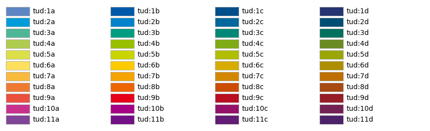

# Cyber Plot Style
Matplotlib style and funcionality for the Cyber-Physical Simulation group.

## Installation

Using [uv](https://docs.astral.sh/uv/) (recomended):
```shell
pip install "dynax @ git+https://github.com/Drenderer/cyberplotstyle.git@main"
```

Using pip:
```shell
pip install "dynax @ git+https://github.com/Drenderer/cyberplotstyle.git@main"
```

> [!WARNING]
> Make sure to include a commit hash to avoid breaking changes as Cyber Plot Style is still in early development. For this replace "main" in the git address with the commit hash of the version that you want to install.

## Usage

Just import the package to activate the default CPS plotting style.

```python
import cyberplotstyle
```

which will set:
```python
axes.prop_cycle:    cycler('color', ['c24c4c', '688fc6', 'f6a315', '16a48a', '435384', 'cccccc', '000000']) # CPS colors
axes.xmargin:       0           # No x margins
figure.dpi:         150
```

This also makes the following colors available as named colors, e.g., with `plt.plot(..., color="cps:orange")`:




The above colors are also available as a dictionary via:
```python
cyberplotstyle.cps_colors
cyberplotstyle.tud_colors
```

### Setting aditional styles
You can set additional styles via
```python
from matplotlib import pyplot as plt
plt.style.use("cyberplotstyle.<style name>")
```

The following stlyes are available:

#### *presentation*:
```python
lines.linewidth:    2           # line width in points
font.size:          15.0        # larger overall fonts
figure.dpi:         300         # figure dots per inch
figure.facecolor:   FFFFFF00    # figure face color (transparent)
```

#### *latex*:
```python
text.usetex: True    # use latex for all text handling.
```
> [!NOTE]
> Requires a working LaTeX installation

### Color manipulation
```def scale_hls(color: ColorType, hue: float = 1.0, lightness: float = 1.0, saturation: float = 1.0) -> tuple[float, float, float, float]```
Return a color with rescaled hue, lightness and/or saturation.
